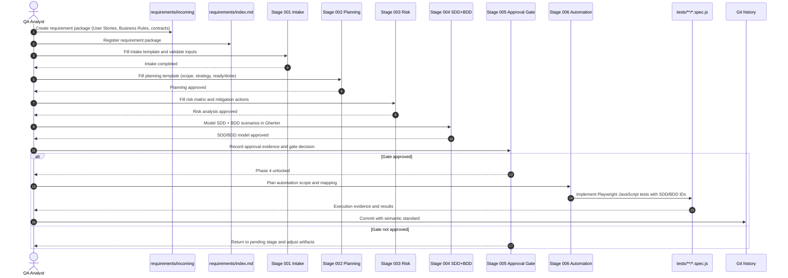

# Base-QA

Base-QA is an opinionated starter kit to accelerate software quality projects with a strong focus on governance, traceability, and predictable delivery.

The repository follows a **Zero-Code First** approach: before any automation starts, the team must produce and approve planning, risk, and test modeling artifacts.

## Purpose

- Standardize the QA pipeline from discovery to automation.
- Ensure automated tests are derived from clear specifications.
- Reduce rework caused by missing functional and technical context.

## Principles

- Mandatory phase-based governance.
- End-to-end traceability (documentation -> scenarios -> scripts).
- Automation is allowed only after explicit QA approval.
- Exclusive automation stack: Playwright + JavaScript.
- BDD-first scenario modeling with Gherkin (`Given/When/Then`).

## How to use this project

### Quick start (practical mode)

Use this path every time you receive a new automation request:

1. Create a requirement package from `requirements/TEMPLATE-REQUIREMENTS.md`.
2. Save it in `requirements/incoming/REQ-YYYYMMDD-###-short-name.md`.
3. Register it in `requirements/index.md`.
4. Execute templates from `changes/001` to `changes/005`.
5. Wait for approval gate confirmation.
6. Execute `changes/006` and implement tests in `tests/**/*.spec.js`.
7. Commit using the semantic commit standard defined below.

### Sequence diagram (end-to-end usage)



## Commit message standard

This project adopts the semantic commit convention from iuricode/padroes-de-commits (Conventional Commits style, without emoji).

Recommended format:

`<type>: <short description>`

Examples:

- `feat: add approval gate traceability`
- `fix: correct risk matrix status mapping`
- `docs: update QA pipeline sequence diagram`
- `test: add scenario for boundary validation`

### Allowed types

| Type | Use when |
|---|---|
| feat | New feature |
| fix | Bug fix |
| docs | Documentation only |
| test | Test creation/update/removal |
| build | Build/dependency changes |
| perf | Performance improvement |
| style | Formatting/lint without logic change |
| refactor | Internal refactor without behavior change |
| chore | Maintenance/config/admin tasks |
| ci | CI pipeline changes |
| raw | Config/data/parameter changes |
| cleanup | Code cleanup/removing dead snippets |
| remove | Removing files/features/deprecated code |

### Good practices

- Keep the first line objective and concise.
- Use the commit body for context, impact, and rationale when needed.
- Add footer references (for example issue/card IDs) when applicable.
- Keep one clear intention per commit whenever possible.

Quick reference with copy-and-paste examples:

- `docs/commit-convention.md`

### 1) Prepare required inputs

Before you start, consolidate:

- User Stories
- Business Rules
- Technical contracts (Swagger/OpenAPI) and/or screen/route map

Without these inputs, the pipeline must not move forward.

### 2) Run the quality pipeline

#### Phase 1 - Planning
File: `docs/test_plan.md`

Expected content:

- Scope (In-scope / Out-of-scope)
- Test approach (API, E2E, contract, etc.)
- Entry (Ready) and Exit (Done) criteria

Mandatory checkpoint at the end of the phase:

> "Do you agree with this phase? Can I proceed to the next stage of the pipeline?"

#### Phase 2 - Risk Analysis
File: `docs/risk_analysis.md`

Expected content:

- Matrix with: Risk | Category | Probability | Impact | Mitigation

Mandatory checkpoint at the end of the phase:

> "Do you agree with this phase? Can I proceed to the next stage of the pipeline?"

#### Phase 3 - SDD + BDD Modeling (Gherkin)
File: `docs/sdd_test_cases.md`

Expected content per specification:

- [ID] Specification name
- Expected behavior
- Scenario checklist:
	- Happy path
	- Exception/negative flows
	- Boundary values
- BDD scenarios in Gherkin:
	- Given initial context
	- When action is executed
	- Then expected outcome
- Preconditions and test data

Mandatory checkpoint at the end of the phase:

> "Do you agree with this phase? Can I proceed to the next stage of the pipeline?"

#### Phase 4 - Automation (only after Phase 3 approval)
Target: `tests/**/*.spec.js`

Rules:

- Implement only scenarios approved in SDD.
- Implement Gherkin intent from approved BDD scenarios.
- Maintain traceability: include SDD/BDD ID in test title.
- Use Playwright Test with JavaScript exclusively.

## Project architecture

Current structure:

```text
Base-QA/
├── requirements/
│   ├── incoming/
│   ├── index.md
│   └── TEMPLATE-REQUIREMENTS.md
├── changes/
│   ├── 001-intake-specification/
│   ├── 002-planning-test-plan/
│   ├── 003-risk-analysis/
│   ├── 004-sdd-bdd-gherkin-modeling/
│   ├── 005-approval-gate/
│   ├── 006-automation-playwright-js/
│   └── RUN-ALL.md
├── .copilot/
│   └── governance.md
├── .github/
│   └── copilot-instructions.md
├── docs/
│   └── qa-pipeline-guide.md
└── README.md
```

Target architecture after automation is unlocked (Phase 4):

```text
Base-QA/
├── changes/
│   └── ...
├── .copilot/
│   └── governance.md
├── .github/
│   └── copilot-instructions.md
├── docs/
│   ├── test_plan.md
│   ├── risk_analysis.md
│   └── sdd_test_cases.md
├── pages/
├── fixtures/
├── utils/
├── tests/
│   └── *.spec.js
└── playwright.config.js
```

## Key files and ownership

- `.copilot/governance.md`: official pipeline rules and lock/unlock criteria.
- `.github/copilot-instructions.md`: operational instructions for any agent/Copilot working in this repo.
- `docs/test_plan.md`: tactical test plan.
- `docs/risk_analysis.md`: technical/business risk matrix.
- `docs/sdd_test_cases.md`: approved SDD + BDD (Gherkin) scenario base for automation.
- `tests/**/*.spec.js`: automated implementation traceable to SDD/BDD IDs.

## Recommended operating flow

1. Receive the validation request.
2. Register User Stories, Business Rules, and contracts in requirements/incoming and update requirements/index.md.
3. Execute stages 001 to 005 under changes.
4. Confirm approval gate in changes/005-approval-gate.
5. Use changes/RUN-ALL.md as the global checklist.
6. Only then start stage 006 and Phase 4 (code).

## Compliance rules

- Do not skip phases.
- Do not generate code before approvals.
- Do not use frameworks outside the defined stack.
- Do not create tests without explicit linkage to an SDD/BDD ID.
- Do not create commit messages outside the semantic commit standard.

## Language and communication

- Default language: English.
- Tone: professional and objective.
- Documents must always be scannable (lists, tables, and clear structure).
