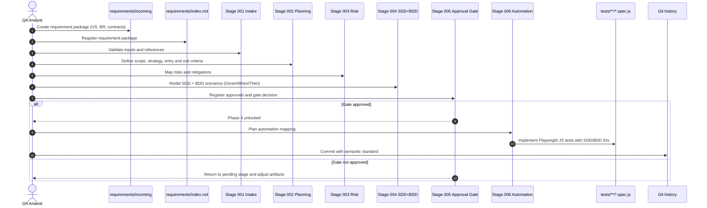

# QA Pipeline Documentation

This folder contains the **mandatory** artifacts of the Zero-Code First pipeline.
The order is sequential - do not proceed without QA approval.

## Numbered incremental structure

The project now uses an incremental stage structure under `../changes/`.
Each stage is isolated in its own numbered folder, with clear goal, checklist, and output.

## Requirements repository

All new User Stories and Business Rules must be stored in `../requirements/` for future consultation and traceability.

- Create one file per request in `../requirements/incoming/`.
- Register each package in `../requirements/index.md`.
- Use `../requirements/TEMPLATE-US-BR.md` as the standard input template.

## Quick start

1. Copy `../requirements/TEMPLATE-US-BR.md`.
2. Save as `../requirements/incoming/REQ-YYYYMMDD-###-short-name.md`.
3. Register the package in `../requirements/index.md`.
4. Execute stages `001` to `005` under `../changes/`.
5. Validate the decision in stage `005-approval-gate`.
6. If approved, execute stage `006` and implement tests in `../tests/**/*.spec.js`.

## Sequence diagram

## Commit convention

This repository uses semantic commits based on iuricode/padroes-de-commits.

Format:

`<type>: <short description>`

Examples:

 `docs: update stage templates`
 `feat: add requirements repository`
 `fix: correct stage gate checklist`
 `test: include negative flow scenario`

Supported types:

- `feat`, `fix`, `docs`, `test`, `build`, `perf`, `style`, `refactor`, `chore`, `ci`, `raw`, `cleanup`, `remove`

Quick reference with copy-and-paste examples:

- `./commit-convention.md`

| Stage | Folder | Purpose |
|------|--------|---------|
| 001 | `../changes/001-intake-specification` | Consolidate required inputs (US, BR, contracts) |
| 002 | `../changes/002-planning-test-plan` | Produce planning and tactical strategy |
| 003 | `../changes/003-risk-analysis` | Build risk matrix and mitigations |
| 004 | `../changes/004-sdd-bdd-gherkin-modeling` | Model SDD + BDD scenarios in Gherkin |
| 005 | `../changes/005-approval-gate` | Validate approvals and unlock gate |
| 006 | `../changes/006-automation-playwright-js` | Implement approved automation in Playwright JS |

Execution orchestrator: `../changes/RUN-ALL.md`

| Phase | File | Status |
|------|---------|--------|
| 1 - Planning | `test_plan.md` | ⏳ pending |
| 2 - Risk Analysis | `risk_analysis.md` | ⏳ pending |
| 3 - SDD + BDD (Gherkin) Modeling | `sdd_test_cases.md` | ⏳ pending |
| 4 - Automation | `../tests/**/*.spec.js` | 🔒 locked until Phase 3 is approved |

Full governance: [../.copilot/governance.md](../.copilot/governance.md)

Gherkin requirement in Phase 3:

- Use `Given/When/Then` for each modeled scenario.
- Keep each scenario linked to a unique SDD/BDD ID.
